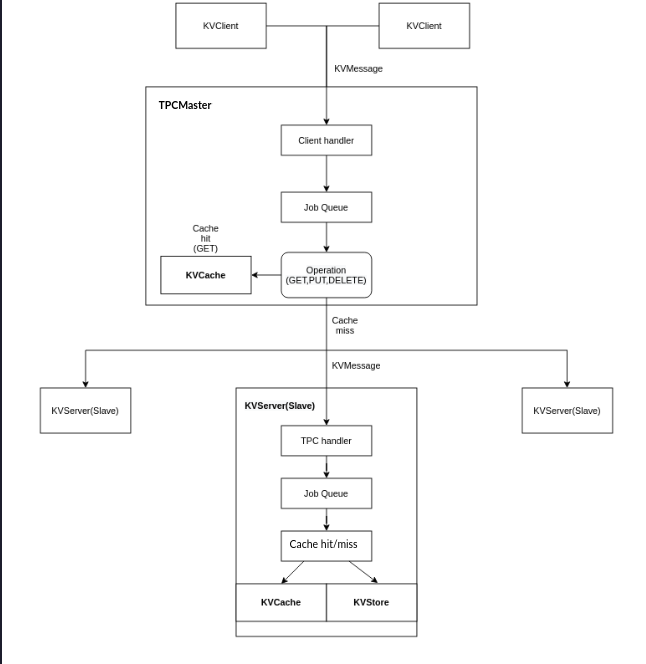

Distributed key-value Store Database systems
================================================

* A key-value store is a database that stores data as a collection of key-value pairs. Here, each key serves as a unique identifier.
* A distributed key-value store system with three simple operations: get, put, and delete is implemented. 
* Consistent Hashing is used to redirect requests to its appropriate server.
* Two-phase commit logic will be used to ensure consistency between servers and the operations put and delete are atomic guaranteed via TPC protocol.
* Replication on multiple servers is used for fault tolerance.

System Architecture
---------------------

KVCache and KVStore
--------------------

KVCache represents the key component to perform concurrent GET operations.A KVCache is specific to a server. Each Cache comprises of various cacheSets which allow for concurrent operations. Each cacheSet, however is an LRU cache which supports sequential operations.

KVStore defines the persistent storage used by a server to store (key, value) entries.
Each entry  is stored as an individual file, all kept in a directory name that is passed upon initialisation.

How To Run
------------

./run.sh in server consists of the start script to spawn the master and slave servers. The number of slave servers to be spawned needs to be specified in the script.

./interactive_client starts up a client on which the various operations are performed.

Running ./run.sh and then the interactive client would be sufficient to start up the project.